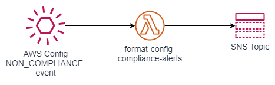

Monitors for AWS Config rule changes to `NON_COMPLIANT` state. An event is published to the default event bus. An event rule monitors for this event. If the event is detected, it triggers the Lambda function `format-config-compliance-alerts` is executed. It formats the event message and publishes the formatted message to the SNS Topic



## Requirements

No requirements.

## Providers

| Name    | Version |
| ------- | ------- |
| archive | n/a     |
| aws     | n/a     |

## Modules

No modules.

## Resources

| Name                                                                                                                                                   | Type        |
| ------------------------------------------------------------------------------------------------------------------------------------------------------ | ----------- |
| [aws_cloudwatch_event_rule.compliance_change_event](https://registry.terraform.io/providers/hashicorp/aws/latest/docs/resources/cloudwatch_event_rule) | resource    |
| [aws_cloudwatch_event_target.event_target](https://registry.terraform.io/providers/hashicorp/aws/latest/docs/resources/cloudwatch_event_target)        | resource    |
| [aws_cloudwatch_log_group.lambda_cw_lg](https://registry.terraform.io/providers/hashicorp/aws/latest/docs/resources/cloudwatch_log_group)              | resource    |
| [aws_lambda_function.function](https://registry.terraform.io/providers/hashicorp/aws/latest/docs/resources/lambda_function)                            | resource    |
| [aws_lambda_permission.config_event_lambda_permissions](https://registry.terraform.io/providers/hashicorp/aws/latest/docs/resources/lambda_permission) | resource    |
| [archive_file.lambda_archive](https://registry.terraform.io/providers/hashicorp/archive/latest/docs/data-sources/file)                                 | data source |

## Inputs

| Name                   | Description                                                                                | Type     | Default                     | Required |
| ---------------------- | ------------------------------------------------------------------------------------------ | -------- | --------------------------- | :------: |
| app\_prefix            | Application Prefix for all AWS Resources                                                   | `string` | n/a                         |   yes    |
| env\_prefix            | Environment Prefix for all AWS Resources                                                   | `string` | n/a                         |   yes    |
| iam\_lambda\_role\_arn | The ARN of the IAM role to be assumed by Lambda to process events and publish to SNS Topic | `any`    | n/a                         |   yes    |
| master\_prefix         | Master Prefix for all AWS Resources                                                        | `string` | n/a                         |   yes    |
| sns\_topic\_arn        | The ARN of the SNS Topic which receives formatted messages and has email subscribers       | `string` | `""`                        |    no    |
| tags                   | Specifies object tags key and value. This applies to all resources created by this module. | `map`    | ```{ "Terraform": true }``` |    no    |

## Outputs

| Name                                  | Description                                                                                              |
| ------------------------------------- | -------------------------------------------------------------------------------------------------------- |
| config\_event\_rule\_arn              | ARN of the EventBridge Event Rule to detect AWS Config compliance change                                 |
| lambda\_function\_arn                 | ARN of the function used to format the AWS Config Compliance event                                       |
| lambda\_function\_cw\_log\_group\_arn | ARN of the CloudWatch Log Group used by the Lambda function that formats the AWS Config Compliance event |
