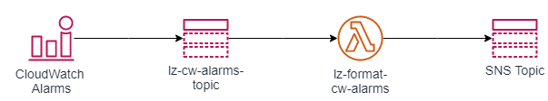

Sets up CloudWatch alarms as per CIS benchmarks Level 1. 

When an alarm is triggered it is published to the SNS Topic: `lz-cw-alarms-topic`. A Lambda function `lz-format-cw-alarms` is configured to subscribe to this topic. it formats the event message and publishes the formatted message to the provided SNS Topic




## Requirements

No requirements.

## Providers

| Name    | Version |
| ------- | ------- |
| archive | n/a     |
| aws     | n/a     |

## Modules

No modules.

## Resources

| Name                                                                                                                                                                  | Type        |
| --------------------------------------------------------------------------------------------------------------------------------------------------------------------- | ----------- |
| [aws_cloudwatch_log_group.lambda_cw_lg](https://registry.terraform.io/providers/hashicorp/aws/latest/docs/resources/cloudwatch_log_group)                             | resource    |
| [aws_cloudwatch_log_metric_filter.aws_config_changes](https://registry.terraform.io/providers/hashicorp/aws/latest/docs/resources/cloudwatch_log_metric_filter)       | resource    |
| [aws_cloudwatch_log_metric_filter.cloudtrail_cfg_changes](https://registry.terraform.io/providers/hashicorp/aws/latest/docs/resources/cloudwatch_log_metric_filter)   | resource    |
| [aws_cloudwatch_log_metric_filter.console_signin_failures](https://registry.terraform.io/providers/hashicorp/aws/latest/docs/resources/cloudwatch_log_metric_filter)  | resource    |
| [aws_cloudwatch_log_metric_filter.disable_or_delete_cmk](https://registry.terraform.io/providers/hashicorp/aws/latest/docs/resources/cloudwatch_log_metric_filter)    | resource    |
| [aws_cloudwatch_log_metric_filter.iam_changes](https://registry.terraform.io/providers/hashicorp/aws/latest/docs/resources/cloudwatch_log_metric_filter)              | resource    |
| [aws_cloudwatch_log_metric_filter.nacl_changes](https://registry.terraform.io/providers/hashicorp/aws/latest/docs/resources/cloudwatch_log_metric_filter)             | resource    |
| [aws_cloudwatch_log_metric_filter.network_gw_changes](https://registry.terraform.io/providers/hashicorp/aws/latest/docs/resources/cloudwatch_log_metric_filter)       | resource    |
| [aws_cloudwatch_log_metric_filter.no_mfa_console_signin](https://registry.terraform.io/providers/hashicorp/aws/latest/docs/resources/cloudwatch_log_metric_filter)    | resource    |
| [aws_cloudwatch_log_metric_filter.root_usage](https://registry.terraform.io/providers/hashicorp/aws/latest/docs/resources/cloudwatch_log_metric_filter)               | resource    |
| [aws_cloudwatch_log_metric_filter.route_table_changes](https://registry.terraform.io/providers/hashicorp/aws/latest/docs/resources/cloudwatch_log_metric_filter)      | resource    |
| [aws_cloudwatch_log_metric_filter.s3_bucket_policy_changes](https://registry.terraform.io/providers/hashicorp/aws/latest/docs/resources/cloudwatch_log_metric_filter) | resource    |
| [aws_cloudwatch_log_metric_filter.security_group_changes](https://registry.terraform.io/providers/hashicorp/aws/latest/docs/resources/cloudwatch_log_metric_filter)   | resource    |
| [aws_cloudwatch_log_metric_filter.unauthorized_api_calls](https://registry.terraform.io/providers/hashicorp/aws/latest/docs/resources/cloudwatch_log_metric_filter)   | resource    |
| [aws_cloudwatch_log_metric_filter.vpc_changes](https://registry.terraform.io/providers/hashicorp/aws/latest/docs/resources/cloudwatch_log_metric_filter)              | resource    |
| [aws_cloudwatch_metric_alarm.aws_config_changes](https://registry.terraform.io/providers/hashicorp/aws/latest/docs/resources/cloudwatch_metric_alarm)                 | resource    |
| [aws_cloudwatch_metric_alarm.cloudtrail_cfg_changes](https://registry.terraform.io/providers/hashicorp/aws/latest/docs/resources/cloudwatch_metric_alarm)             | resource    |
| [aws_cloudwatch_metric_alarm.console_signin_failures](https://registry.terraform.io/providers/hashicorp/aws/latest/docs/resources/cloudwatch_metric_alarm)            | resource    |
| [aws_cloudwatch_metric_alarm.disable_or_delete_cmk](https://registry.terraform.io/providers/hashicorp/aws/latest/docs/resources/cloudwatch_metric_alarm)              | resource    |
| [aws_cloudwatch_metric_alarm.iam_changes](https://registry.terraform.io/providers/hashicorp/aws/latest/docs/resources/cloudwatch_metric_alarm)                        | resource    |
| [aws_cloudwatch_metric_alarm.nacl_changes](https://registry.terraform.io/providers/hashicorp/aws/latest/docs/resources/cloudwatch_metric_alarm)                       | resource    |
| [aws_cloudwatch_metric_alarm.network_gw_changes](https://registry.terraform.io/providers/hashicorp/aws/latest/docs/resources/cloudwatch_metric_alarm)                 | resource    |
| [aws_cloudwatch_metric_alarm.no_mfa_console_signin](https://registry.terraform.io/providers/hashicorp/aws/latest/docs/resources/cloudwatch_metric_alarm)              | resource    |
| [aws_cloudwatch_metric_alarm.root_usage](https://registry.terraform.io/providers/hashicorp/aws/latest/docs/resources/cloudwatch_metric_alarm)                         | resource    |
| [aws_cloudwatch_metric_alarm.route_table_changes](https://registry.terraform.io/providers/hashicorp/aws/latest/docs/resources/cloudwatch_metric_alarm)                | resource    |
| [aws_cloudwatch_metric_alarm.s3_bucket_policy_changes](https://registry.terraform.io/providers/hashicorp/aws/latest/docs/resources/cloudwatch_metric_alarm)           | resource    |
| [aws_cloudwatch_metric_alarm.security_group_changes](https://registry.terraform.io/providers/hashicorp/aws/latest/docs/resources/cloudwatch_metric_alarm)             | resource    |
| [aws_cloudwatch_metric_alarm.unauthorized_api_calls](https://registry.terraform.io/providers/hashicorp/aws/latest/docs/resources/cloudwatch_metric_alarm)             | resource    |
| [aws_cloudwatch_metric_alarm.vpc_changes](https://registry.terraform.io/providers/hashicorp/aws/latest/docs/resources/cloudwatch_metric_alarm)                        | resource    |
| [aws_lambda_function.function](https://registry.terraform.io/providers/hashicorp/aws/latest/docs/resources/lambda_function)                                           | resource    |
| [aws_lambda_permission.cw_alarms_topic_lambda_permissions](https://registry.terraform.io/providers/hashicorp/aws/latest/docs/resources/lambda_permission)             | resource    |
| [aws_sns_topic.cw_alarms_sns_topic](https://registry.terraform.io/providers/hashicorp/aws/latest/docs/resources/sns_topic)                                            | resource    |
| [aws_sns_topic_subscription.lambda_subscription](https://registry.terraform.io/providers/hashicorp/aws/latest/docs/resources/sns_topic_subscription)                  | resource    |
| [archive_file.lambda_archive](https://registry.terraform.io/providers/hashicorp/archive/latest/docs/data-sources/file)                                                | data source |

## Inputs

| Name                                 | Description                                                                                                                   | Type     | Default                     | Required |
| ------------------------------------ | ----------------------------------------------------------------------------------------------------------------------------- | -------- | --------------------------- | :------: |
| app\_prefix                          | Application Prefix for all AWS Resources                                                                                      | `string` | n/a                         |   yes    |
| aws\_config\_changes\_enabled        | The boolean flag whether the aws\_config\_changes alarm is enabled or not. No resources are created when set to false.        | `bool`   | `true`                      |    no    |
| cloudtrail\_cfg\_changes\_enabled    | The boolean flag whether the cloudtrail\_cfg\_changes alarm is enabled or not. No resources are created when set to false.    | `bool`   | `true`                      |    no    |
| cloudtrail\_log\_group\_name         | The name of the CloudWatch Logs group to which CloudTrail events are delivered.                                               | `any`    | n/a                         |   yes    |
| console\_signin\_failures\_enabled   | The boolean flag whether the console\_signin\_failures alarm is enabled or not. No resources are created when set to false.   | `bool`   | `true`                      |    no    |
| disable\_or\_delete\_cmk\_enabled    | The boolean flag whether the disable\_or\_delete\_cmk alarm is enabled or not. No resources are created when set to false.    | `bool`   | `true`                      |    no    |
| enabled                              | The boolean flag whether this module is enabled or not. No resources are created when set to false.                           | `bool`   | `true`                      |    no    |
| env\_prefix                          | Environment Prefix for all AWS Resources                                                                                      | `string` | n/a                         |   yes    |
| iam\_changes\_enabled                | The boolean flag whether the iam\_changes alarm is enabled or not. No resources are created when set to false.                | `bool`   | `true`                      |    no    |
| iam\_lambda\_role\_arn               | The ARN of the IAM role to be assumed by Lambda to process events and publish to SNS Topic                                    | `any`    | n/a                         |   yes    |
| master\_prefix                       | Master Prefix for all AWS Resources                                                                                           | `string` | n/a                         |   yes    |
| metric\_namespace                    | The namespace in which all alarms are set up.                                                                                 | `string` | `"CISBenchmark"`            |    no    |
| nacl\_changes\_enabled               | The boolean flag whether the nacl\_changes alarm is enabled or not. No resources are created when set to false.               | `bool`   | `true`                      |    no    |
| network\_gw\_changes\_enabled        | The boolean flag whether the network\_gw\_changes alarm is enabled or not. No resources are created when set to false.        | `bool`   | `true`                      |    no    |
| no\_mfa\_console\_signin\_enabled    | The boolean flag whether the no\_mfa\_console\_signin alarm is enabled or not. No resources are created when set to false.    | `bool`   | `true`                      |    no    |
| root\_usage\_enabled                 | The boolean flag whether the root\_usage alarm is enabled or not. No resources are created when set to false.                 | `bool`   | `true`                      |    no    |
| route\_table\_changes\_enabled       | The boolean flag whether the route\_table\_changes alarm is enabled or not. No resources are created when set to false.       | `bool`   | `true`                      |    no    |
| s3\_bucket\_policy\_changes\_enabled | The boolean flag whether the s3\_bucket\_policy\_changes alarm is enabled or not. No resources are created when set to false. | `bool`   | `true`                      |    no    |
| security\_group\_changes\_enabled    | The boolean flag whether the security\_group\_changes alarm is enabled or not. No resources are created when set to false.    | `bool`   | `true`                      |    no    |
| sns\_topic\_arn                      | The ARN of the SNS Topic which receives formatted messages and has email subscribers                                          | `string` | `""`                        |    no    |
| tags                                 | Specifies object tags key and value. This applies to all resources created by this module.                                    | `map`    | ```{ "Terraform": true }``` |    no    |
| unauthorized\_api\_calls\_enabled    | The boolean flag whether the unauthorized\_api\_calls alarm is enabled or not. No resources are created when set to false.    | `bool`   | `true`                      |    no    |
| vpc\_changes\_enabled                | The boolean flag whether the vpc\_changes alarm is enabled or not. No resources are created when set to false.                | `bool`   | `true`                      |    no    |

## Outputs

| Name                                  | Description                                                                                          |
| ------------------------------------- | ---------------------------------------------------------------------------------------------------- |
| cw\_alarms\_sns\_topic                | The SNS topic to which CloudWatch Alarms will be sent.                                               |
| lambda\_function\_arn                 | ARN of the function used to format the CloudWatch Alarms event                                       |
| lambda\_function\_cw\_log\_group\_arn | ARN of the CloudWatch Log Group used by the Lambda function that formats the CloudWatch Alarms event |
